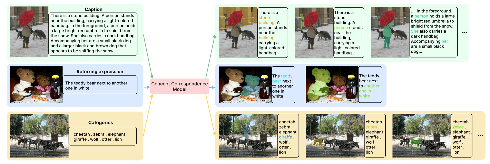

<div align="center">

# ConCor-1

### Vision-Language Grounding as Bidirectional Concept Correspondence

[Jieyu Zhang](https://jieyuz2.github.io)\*, [Ziqi Gao](https://uwgzq.github.io)\*, [Luke Zettlemoyer](https://homes.cs.washington.edu/~lsz/), [Ranjay Krishna](https://www.ranjaykrishna.com)

\*Equal contribution

[](https://arxiv.org/abs/2608.07886)
[](https://uwgzq.github.io/papers/ConCor-1/)
[](https://huggingface.co/UWGZQ/ConCor-1)
[](https://huggingface.co/datasets/UWGZQ/ConCor-1-Data)
[](https://huggingface.co/spaces/UWGZQ/ConCor-1-demo)
[](LICENSE)



</div>

ConCor-1 formulates vision-language grounding as **bidirectional concept correspondence**. Given an image and paired text, it predicts the complete set of correspondences between visually referential text spans and instance-level image masks, without assuming that the relevant text spans are provided. Each correspondence contains a text mask, an image mask, and a correspondence presence score.


## News

* **2026-08-08** — Release: [model weights](https://huggingface.co/UWGZQ/ConCor-1),
  [data](https://huggingface.co/datasets/UWGZQ/ConCor-1-Data) and the inference code in this repository.


## TODOs

- [ ] Release evaluation code.
- [ ] Release training code.


## Contents

| | |
|---|---|
| [Installation](#installation) | environment setup, verified end to end |
| [Quick start](#quick-start) | Python API and the command-line script |
| [Demo](#demo) | the hosted Space, and running it locally |
| [Data](#data) | the released annotations and how to join images onto them |
| [Results](#results) | what the paper reports |
| [`docs/`](docs) | [INFERENCE](docs/INFERENCE.md) — thresholds, batching rules, output fields |

## Installation

ConCor-1 inference needs a CUDA GPU, PyTorch ≥ 2.8 and **transformers 5.3.0 exactly**. Nothing here
needs a compiler; the two optional speed-ups do.

```bash
git clone https://github.com/uwGZQ/ConCor-1.git
cd ConCor-1

conda create -n concor1 python=3.11 -y
conda activate concor1

# Pick the CUDA build you need; cu128 is what the checkpoint was trained and evaluated with.
pip install torch==2.8.0 torchvision==0.23.0 --index-url https://download.pytorch.org/whl/cu128
```

Then pick one of two paths.

**As a package (recommended).** `import concor1` then works from any directory:

```bash
pip install -e .

pip install -e ".[data]"    # + pyarrow, pycocotools — reading the released annotation parquets
pip install -e ".[demo]"    # + gradio — the local demo in demo/app.py
```

**Dependencies only.** This installs what ConCor-1 needs but *not* the `concor1` package, so
`import concor1` resolves only when your working directory is the repository root:

```bash
pip install -r requirements.txt
```


**Optional speed-ups.** Both need a CUDA compiler:

```bash
pip install 'flash-attn==2.8.3.post1+cu.12.8.torch.2.8'   --extra-index-url https://wheels.astral.sh/simple/cu128/
pip install "causal-conv1d>=1.4.0" --no-build-isolation
```


**Notes.** The weights (~1.7 GB) download from the Hub on first use; set `HF_HOME` to relocate the
cache. Loading uses `trust_remote_code=True`, because the modelling, configuration and processing
code live in the model repository. `flash-linear-attention` compiles Triton kernels at runtime — set
`TRITON_CACHE_DIR` to a private writable path if `~/.triton` is shared or read-only.


## Quick start

```python
from PIL import Image
from concor1 import load_concor1, predict, render_correspondences

model, processor = load_concor1()          # UWGZQ/ConCor-1, or a local path

image = Image.open("examples/bear.jpg").convert("RGB")
text = (
    "This image depicts a close-up of a brown bear in a natural outdoor setting. "
    "The background consists of lush green grass. In the foreground, a large brown bear "
    "is positioned centrally."
)

for correspondence in predict(model, processor, image, text):
    print(
        f"{correspondence['presence_score']:.3f}",
        correspondence["text_phrases"],   # the phrases in this correspondence's text mask
        correspondence["text_spans"],     # character spans into `text`
        correspondence["mask"].shape,     # bool array, (height, width)
    )

render_correspondences(image, text, predict(model, processor, image, text)).save("out.png")
```

Command-line inference:

```bash
# one pair
python scripts/run_inference.py --image examples/bear.jpg --text "a brown bear" --output_dir outputs/

# a category list
python scripts/run_inference.py --image examples/bear.jpg --text "bear . grass . tree . person"

# a whole file of pairs, batched
python scripts/run_inference.py --input_json examples/examples.json --batch_size 4 --output_dir outputs/
```


Check
[`docs/INFERENCE.md`](docs/INFERENCE.md) for more details.

## Demo

The hosted demo is at [**UWGZQ/ConCor-1-demo**](https://huggingface.co/spaces/UWGZQ/ConCor-1-demo).
The same app runs locally:

```bash
pip install -e ".[demo]"
python demo/app.py                     # http://localhost:7860
```

Upload an image, type its text, and the demo shows each correspondence's mask and its underlined
text span in the same colour. The threshold sliders re-render from cached logits, so tuning them is
instant.

## Data

[**`UWGZQ/ConCor-1-Data`**](https://huggingface.co/datasets/UWGZQ/ConCor-1-Data) holds the training
and evaluation annotations in one unified correspondence format: a **text mask** (a set of character
spans) paired with an **image mask** (an instance-level segment).

Images are **not** redistributed — you join them on `image_key` against your own copies of the
source datasets.

```python
from concor1.data import IMAGE_ROOTS, hub_parquet, iter_samples

IMAGE_ROOTS["coco"] = "/data/coco"                    # holds train2017/ and val2017/
for sample in iter_samples(hub_parquet("coconut_pancap", "validation")):
    for correspondence in sample["correspondences"]:
        correspondence["char_spans"]                  # [[start, end), ...] into sample["text"]
        correspondence["phrases"]                     # the spanned substrings
        correspondence["mask"]                        # bool array (height, width)
```

```bash
# print a sample, and render its ground truth over the image
python scripts/inspect_data.py --config coconut_pancap --split validation --index 0 \
    --image_root coco=/data/coco --output gt.png
```

## Results

| Setting | Benchmark | JointF1 | mJS |
|---|---|---:|---:|
| Image-caption | COCONut-PanCap | **88.8** | **89.5** |
| Image-caption | GroundedRef | **70.3** | **69.6** |
| Image-caption | Flickr30k | **91.4** | **91.8** |
| Image-category | COCO | **72.4** | **79.8** |
| Image-category | LVIS-minival | **29.9** | **39.8** |
| Image-category | EntitySeg | **49.8** | **48.9** |

See the [paper](https://uwgzq.github.io/papers/ConCor-1/) and [project page](https://uwgzq.github.io/papers/ConCor-1/) for full comparisons and evaluation details.

## Repository structure

```
ConCor-1/
├── concor1/                  # importable package
│   ├── inference.py          #   loading, batched prediction
│   ├── visualize.py          #   mask overlays, grounded-text rendering
│   └── data.py               #   reader for the released annotation parquets
├── scripts/
│   ├── run_inference.py      # CLI: image(s) + text → correspondences, overlays, JSON
│   └── inspect_data.py       # CLI: inspect and render released ground truth
├── demo/app.py               # local Gradio demo
├── docs/                     # INFERENCE
├── examples/                 # example images + their paired texts
└── assets/                   # figures
```


## License

The code in this repository is released under the [Apache 2.0 License](LICENSE). Dataset licenses vary by source; see the [dataset card](https://huggingface.co/datasets/UWGZQ/ConCor-1-Data) for details.

## Citation

```bibtex
@article{zhang2026concor,
  title   = {Vision-Language Grounding as Bidirectional Concept Correspondence},
  author  = {Zhang, Jieyu and Gao, Ziqi and Zettlemoyer, Luke and Krishna, Ranjay},
  year    = {2026}
}
```

## Acknowledgements

ConCor-1 is built on [Qwen3.5-0.8B](https://huggingface.co/Qwen/Qwen3.5-0.8B) (Apache 2.0).
